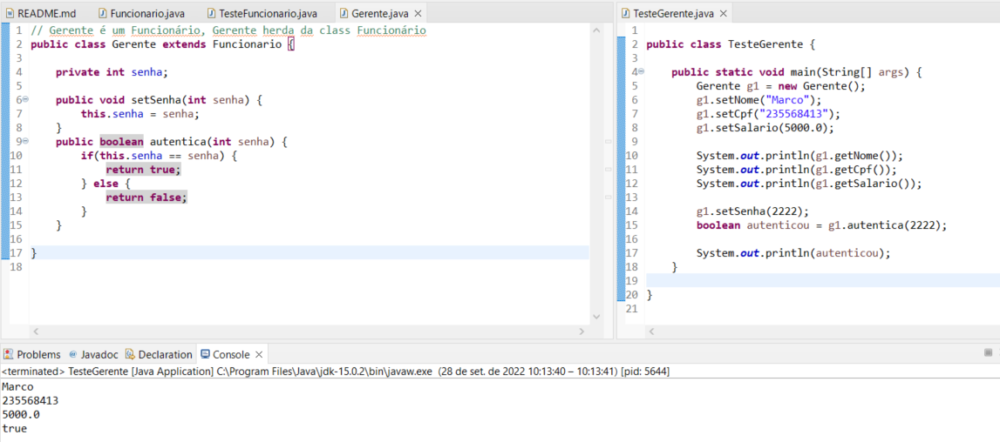
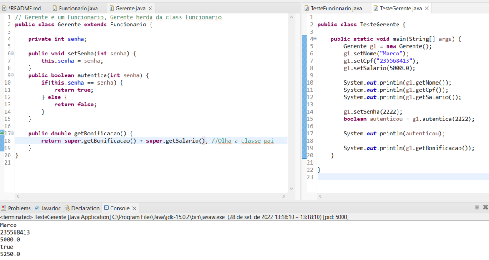
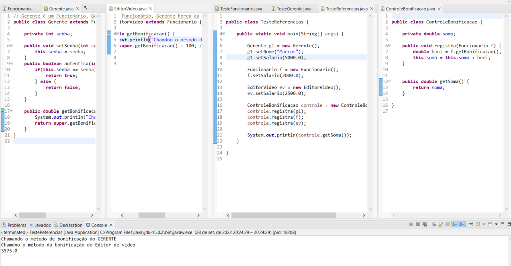
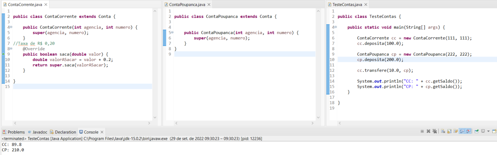
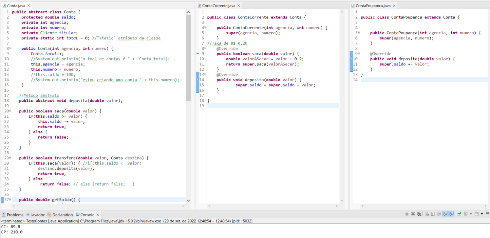

### Java Polimorfismo: entenda herança e interfaces

**Faça esse curso de Java e:**

- Reuse código com classes Herança e Composição

- Implemente interface e métodos abstratas

- Entenda o que é Polimorfismo

- Aprenda sobre reescrita e herança de métodos

- Conheça super e protected

**Instrutor:** 
[Nico Steppat](https://github.com/steppat)
 
__________________________________________

**Nessa aula começamos a falar sobre a herança e aprendemos:**

- quais problemas a herança pode resolver

- como usar herança no Java através de palavra chave **extends**

- ao herdar, a classe filha ganha todas as características (atributos) e todas as funcionalidades (métodos) da classe mãe

- conhecemos o primeiro benefício da herança: Reutilização do código

Na próxima aula veremos mais detalhes sobre herança como as palavras chaves **super**, **protected** e a sobrescrita de métodos!

### 02. Super e reescrita de métodos

**Nessa aula já entramos mais a fundo na herança. Aprendemos:**

- que classe mãe é chamada de super ou base class

- que a classe filha também é chamada de sub class

- como aumentar a visibilidade de um membro (atributo, método) através do **protected**

- como acessar ou chamar um membro (atributo, método) através do **super**

- como redefinir um método através da sobrescrita

Na próxima aula veremos um novo benefício da herança, o **Polimorfismo**. 

### 03. Entendendo Polimorfismo

**Nessa aula aprendemos que:**

- objetos não mudam de tipo;

- a referência pode mudar, e aí entra o polimorfismo;

- o polimorfismo permite usar referências mais genéricas para a comunicação com um objeto;

- o uso de referências mais genéricas permite desacoplar sistemas.

No próximo vídeo vamos falar sobre como se comportam os construtores na herança.

**Aplicando Polimorfismo**

### 04. Herança e o uso de construtores

**Nessa aula, vimos:**

- Conceitos de herança, construtores e polimorfismo

- A utilização da anotação **@Override**

- Construtores não são herdados

- Um construtor da classe mãe pode ser chamado através do **super()**

O próximo conteúdo vamos falar como se comportam classes e métodos abstratos! 

### 05. Classes e métodos abstratos

**Nessa aula aprendemos:**

- O que são classes abstratas

- Para que servem classes abstratas

- O que são métodos abstratos

- Para que servem métodos abstratos

Na próxima aula veremos sobre o uso de **Interfaces**!

### 06. Interfaces

 